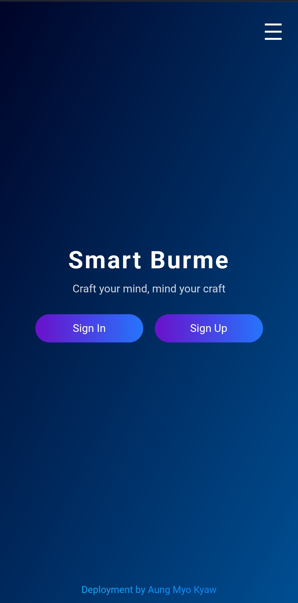

# Smart Burme - Web Application



## Overview
Smart Burme is a responsive web application with a modern UI design featuring gradient backgrounds, smooth animations, and mobile-friendly layout. The application includes login/signup functionality and a sliding menu navigation system.

## Features

- **Responsive Design**: Works on mobile, tablet, and desktop devices
- **Modern UI**:
  - Gradient background and text effects
  - Smooth sliding menu animation
  - Centered card-style layout
- **Device Detection**: Automatically detects mobile/desktop browsers
- **Responsive Buttons**: Perfectly centered Sign In/Sign Up buttons that adapt to screen size

## File Structure
```
smart-burme/
├── assets/
│   ├── css/
│   │   └── style.css
│   ├── js/
│   │   └── main.js
│   └── images/
│       └── background.jpg
├── scr/
│   ├── auth/
│   │   ├── firebase/
│   │   │   └── auth.html
│   │   └── user/
│   │       └── sing.html
│   ├── features/
│   │   ├── newfeed.html
│   │   ├── chatting.html
│   │   └── friends.html
│   └── menu/
│       ├── account.html
│       ├── setting.html
│       └── about.html
├── index.html
├── README.md
└── LICENSE
```
## Structure 

1. **Root Directory**
   - `index.html`: Main entry point
   - `README.md`: Project documentation
   - `LICENSE`: Project license file

2. **Assets Directory**
   - `css/style.css`: All styling rules
   - `js/main.js`: JavaScript functionality
   - `images/`: All image assets

3. **Source (scr) Directory**
   - `auth/`: Authentication related files
     - `firebase/`: Firebase integration
     - `user/`: User authentication
   - `features/`: Core application features
   - `menu/`: Navigation menu pages

### Key Improvements:

1. **Separation of Concerns**:
   - CSS, JS, and images moved to dedicated folders
   - Auth-related files grouped together
   - Features separated from menu items 

2. **Better Organization**:
   - Clear distinction between assets and source code
   - Logical grouping of related files
   - Scalable structure for future additions

3. **Maintainability**:
   - Easier to locate specific files
   - Better for team collaboration
   - More professional project structure

This structure follows modern web development practices and makes the project more maintainable as it grows. You can move the CSS and JavaScript from the HTML file to their respective files in the assets folder for better code organization.

## Installation

No installation required. Simply open `index.html` in any modern web browser.

## Usage

1. Open the application in your browser
2. Use the hamburger menu (☰) to access navigation
3. Click "Sign In" or "Sign Up" to access respective functions

## Responsive Breakpoints

- **Mobile**: <600px (stacks elements vertically)
- **Tablet**: 601px-1024px (adjusted font sizes)
- **Desktop**: >1024px (full layout)

## Technologies Used

- HTML5
- CSS3 (Flexbox, Media Queries, Gradients)
- JavaScript (Basic DOM manipulation)

## Customization

To modify styles:
1. Edit the `<style>` section in `index.html`
2. Main color scheme uses these gradients:
   - Background: `#000428` to `#004e92`
   - Buttons: `#6a11cb` to `#2575fc`
   - Text: `#00c6ff` to `#0072ff`

## License

Free to use and modify. Credit to original author appreciated.

---

**Deployment by Aung Myo Kyaw**  
*Last Updated: 2023-11-15*
